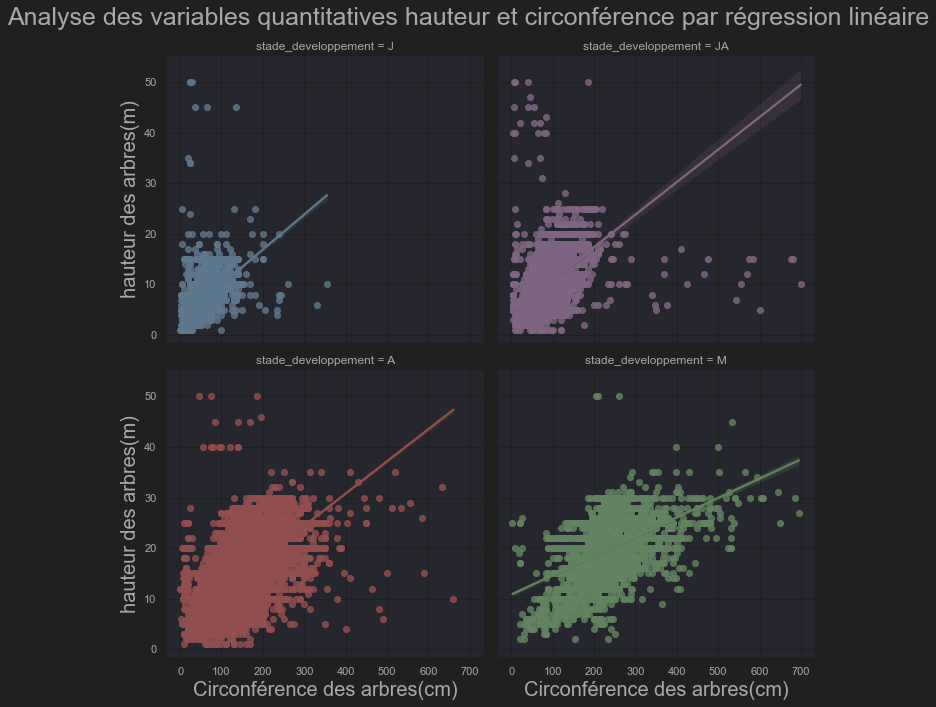
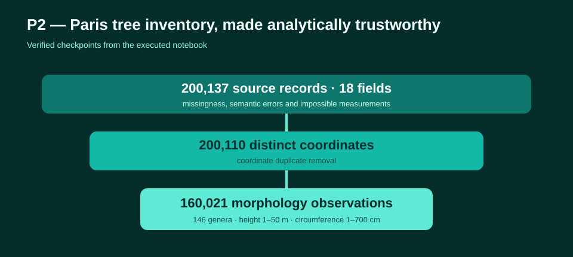
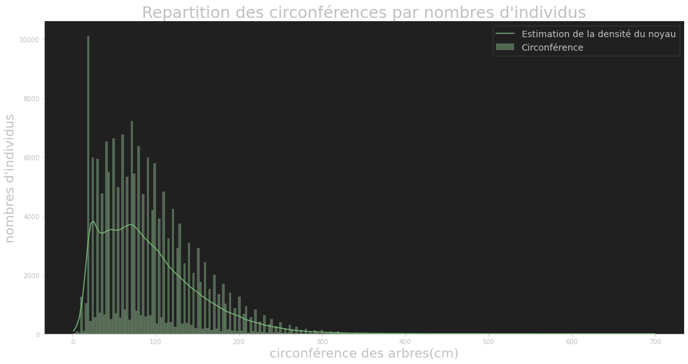
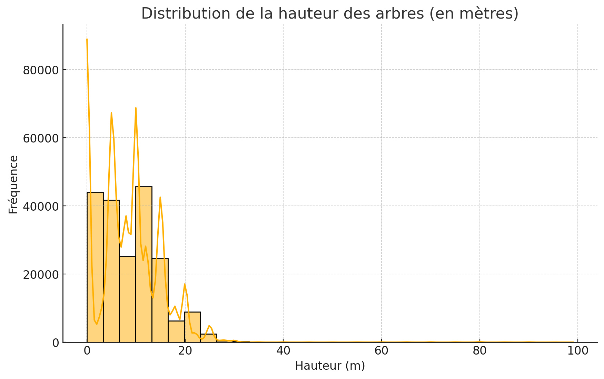

# Paris Trees — Exploratory Data Analysis

Exploratory analysis of nearly 200,000 trees from the City of Paris open-data portal. The project demonstrates data-quality checks, outlier handling, spatial and biodiversity exploration, descriptive statistics and the relationship between tree height and circumference.

## Highlights

- reproducible analysis based on an official open dataset;
- explicit cleaning rules for impossible measurements and missing values;
- visual comparison of height and circumference distributions;
- spatial and taxonomic views supporting a Smart City narrative;
- linear-regression exploration;
- documented notebooks plus testable preparation functions.



## Case-study gallery

| Study | Focus |
|---|---|
| [01 — Data quality](notebooks/01_data_quality.ipynb) | schema, missingness, duplicates and physically implausible measurements |
| [02 — Urban distribution](notebooks/02_urban_distribution.ipynb) | arrondissement and site-level distribution with exposure-aware interpretation |
| [03 — Biodiversity](notebooks/03_biodiversity.ipynb) | genus/species diversity and concentration |
| [04 — Tree morphology](notebooks/04_tree_morphology.ipynb) | height, circumference, outliers and regression limits |
| [Original narrative analysis](notebooks/P2_01_notebook.ipynb) | complete historical analysis retained on the refreshed branch |

`main` and `portfolio-refresh` currently contain the same cleaned implementation. The gallery makes the different analytical questions visible without duplicating raw data.

## Historical evidence and current competencies

The retained analysis notebook contains **87 cells, 50 stored outputs and 11 figures**. Its verified workflow covers:

- **200,137 trees × 18 fields** from the Paris inventory;
- missingness and semantic-error analysis, including values placed in the wrong fields;
- coordinate-based duplicate removal, producing 200,110 distinct locations;
- defensible morphology filters, yielding **160,021 analysable trees**;
- distributions across 25 administrative labels, nine management domains, 192 French labels, **175 genera** and 539 species before final filtering;
- 146 represented genera in the final analytical sample, led by Platanus;
- lifecycle comparison across young, young-adult, adult and mature trees;
- height/circumference Pearson correlation of **0.7973**, followed by stage-specific linear regressions.



The [analysis inventory](synthese/analysis_inventory.md) preserves the decisions and verified results while distinguishing measurement anomalies from genuine exceptional trees.

## Repository structure

```text
notebooks/          narrative analysis and focused case studies
src/                reusable data preparation
tests/              fast unit tests on synthetic data
images/             exported results
synthese/           short project summary
```

## Reproduce the analysis

```bash
python -m venv .venv
pip install -r requirements.txt
jupyter lab notebooks/P2_01_notebook.ipynb
```

The raw dataset is not committed. Download the current tree inventory from the [Paris Open Data portal](https://opendata.paris.fr/) and record the dataset version/date used.

## Selected results

### Circumference distribution



### Height distribution



## Data responsibility

The source is public municipal data. Generated results should be interpreted as an exploratory snapshot, not as an operational diagnosis of individual trees.

## License

Released under the [MIT License](LICENSE).

